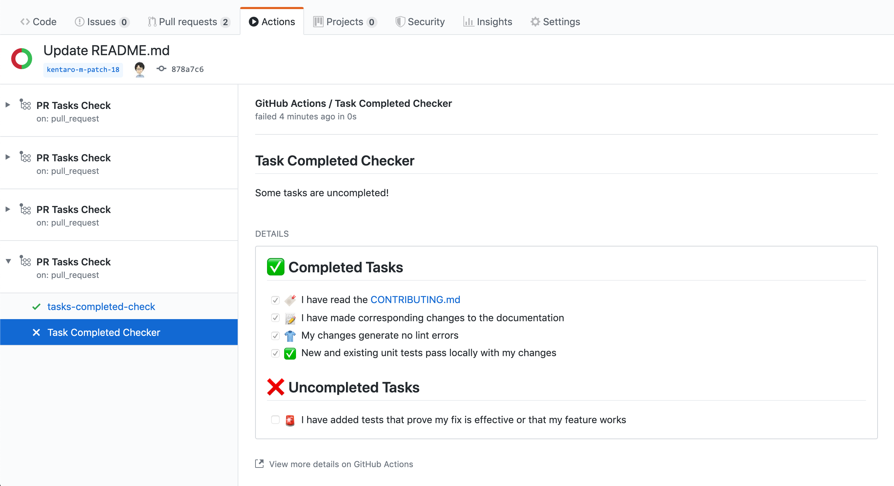

# Task Completed Checker Action
A GitHub action that checks if all tasks are completed in the pull requests.

## Usage

### Create a workflow
```yml
name: 'PR Tasks Completed Check'
on:
  pull_request:
    types: [opened, edited, synchronize]

permissions:
  # Pull requests and related comments, assignees, labels, milestones, and merges.
  # https://developer.github.com/v3/apps/permissions/#permission-on-pull-requests
  pull-requests: read
  # Checks on code.
  # https://developer.github.com/v3/apps/permissions/#permission-on-checks
  checks: write

jobs:
  task-check:
    runs-on: ubuntu-latest
    steps:
      - uses: jemmic/task-completed-checker-action@v1.0.0
        with:
          repo-token: "${{ secrets.GITHUB_TOKEN }}"
          missing-as-error: false
```

### Check whether tasks are completed
Add a pull request template to your repository (`.github/pull_request_template.md`).

For example: 
```markdown
## Issue Type
<!-- ignore-task-list-start -->
* [ ] Bug
- [ ] Document
- [ ] Enhancement
<!-- ignore-task-list-end -->

## Checklist
- [x] I have read the [CONTRIBUTING.md]()
* [x] I have made corresponding changes to the documentation
- [x] My changes generate no lint errors
- [x] I have added tests that prove my fix is effective or that my feature works
- [x] New and existing unit tests pass locally with my changes
```

Create a pull request that contains a tasks list to your repository and GitHub will start automatically a workflow to check whether tasks are completed.

Every edit of the pull request description will automatically start a new workflow to check for completed tasks.

This works only with task lists in the pull request description, not in comments.
It works with task lists defined with either `*` or `-` characters.


You can check a list of completed tasks and uncompleted tasks at the Actions page.


### Ignore checks whether tasks are completed
Please surround the task list with `<!-- ignore-task-list-start -->` and `<!-- ignore-task-list-end -->` for ignoring checks whether tasks are completed.

```markdown
## Issue Type
<!-- ignore-task-list-start -->
- [ ] Bug
* [ ] Document
- [x] Enhancement
<!-- ignore-task-list-end -->

## Checklist
- [x] I have read the [CONTRIBUTING.md]()
- [x] I have made corresponding changes to the documentation
- [x] My changes generate no lint errors
* [x] I have added tests that prove my fix is effective or that my feature works
- [x] New and existing unit tests pass locally with my changes
```

### Treat uncompleted tasks as error
By default, Tasks Completed Check treats uncompleted tasks as pending.
By setting the optional `missing-as-error` parameter to `true`, uncompleted tasks will be treated as an error.
```
      - uses: jemmic/task-completed-checker-action@v1.0.0
        with:
          repo-token: "${{ secrets.GITHUB_TOKEN }}"
          missing-as-error: true
```


You can check a list of completed tasks and uncompleted tasks at the Actions page.



### Scan all comments for tasks as well
By default, Tasks Completed Check only scans the pull-request description for task lists.
By setting the optional `scan-comments` parameter to `true`, also all comments on a pull request (comment, review, review comment) will be scanned for task lists.
```
      - uses: jemmic/task-completed-checker-action@v1.0.0
        with:
          repo-token: "${{ secrets.GITHUB_TOKEN }}"
          scan-comments: true
```

## :memo: Licence
MIT